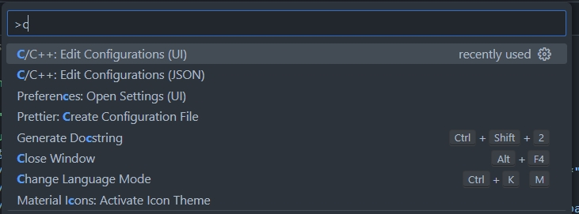

# OpenMM Plugin For Computing Thermal Conductivity Inside Proteins

## Requirements

1. C++ 計算ルーチン
1. Python ライブラリ使用者向けC++ラッパー
1. pybind11 C++/Python バインディングライブラリ

## Set up your development environment
### Dependencies
1. Python 3.10 ~ 3.11.x
1. gcc (Ubuntu 9.4.0-1ubuntu1~20.04.2) 9.4.0
1. cmake version 3.16.x
1. OpenMM (Python ライブラリ) 8.x
1. pybind11 2.11.x
1. nanobind 1.6.x

### Set up your virtual environment
Excecute these commands below to establish your dev environment.
```bash
pyenv update
pyenv install miniconda3-3.11-23.5.2-0
pwd # Be sure your are on workspace dir
pyenv local miniconda3-3.11-23.5.2-0
which conda && conda --version # --> {workspace_dir}/.pyenv/shims/conda
# --> conda 23.5.2
conda create -n openmm-heat-plugin-dev
conda activate openmm-heat-plugin-dev
conda install pip # pybind11, nanobind packages are not provided via anaconda or conda-forge.
which pip # --> ~/miniconda3/envs/openmm-heat-plugin-dev/bin/pip
conda install -c conda-forge gcc=13.2.0 openmm=8.0.0 # For further information, See http://docs.openmm.org/latest/userguide/application/01_getting_started.html#installing-openmm
```

Verify openmm installation
```bash
python -m openmm.testInstallation
```

### Install packages for C++/python bindings
```
pip install pybind11 nanobind
```

### Configure IntelliSense for VSCode
By default, IntelliSense can't detect pybind11, nanobind header files. To avoid this issue, configure c_cpp_properties.json.

Select C/C++: Edit Configurations (UI) or (JSON) by opening VSCode command pallete.

Configure includepath for your conda environment (Example below)
```json
{
    "configurations": [
        {
            "name": "Linux",
            "includePath": [
                "${workspaceFolder}/**",
                "${env:CONDA_PREFIX}/include/python3.11/**",
                "${env:CONDA_PREFIX}/include/**",
                "${env:CONDA_PREFIX}/lib/python3.11/site-packages/nanobind/include/**"
            ],
            "defines": [],
            "compilerPath": "/bin/gcc",
            "cStandard": "c17",
            "intelliSenseMode": "linux-gcc-x64"
        }
    ],
    "version": 4
}
```

Replace ${env:CONDA_PREFIX} with absolute path (e.x. /home/{user}/miniconda3/envs/{env_name}) if IntelliSense can't properly detect header files.

## Project Goal

We aim users can compute the heat flux inside proteins in parallel with MD computing driven by OpenMM.

```python
# Input Files
pdb = PDBFile('input/7r98-processed.pdb')
forcefield = ForceField('amber14-all.xml', 'amber14/tip3pfb.xml')

# Some Configuration
# ...

# Prepare the Simulation
topology = pdb.topology
positions = pdb.positions
system = forcefield.createSystem(topology, nonbondedMethod=nonbondedMethod, nonbondedCutoff=nonbondedCutoff,
    constraints=constraints, rigidWater=rigidWater, ewaldErrorTolerance=ewaldErrorTolerance)
system.addForce(MonteCarloBarostat(pressure, temperature, barostatInterval))
integrator = LangevinMiddleIntegrator(temperature, friction, dt)
integrator.setConstraintTolerance(constraintTolerance)
simulation = Simulation(topology, system, integrator, platform, platformProperties)
simulation.context.setPositions(positions)

# Minimize and Equilibrate
simulation.minimizeEnergy()
simulation.context.setVelocitiesToTemperature(temperature)
simulation.step(equilibrationSteps)

# Simulate
simulation.reporters.append(HeatFluxReporter(outpath="out/heat_flux.nc", interval=1000, decomp=True, cutoff=1.0*nanometer))
simulation.currentStep = 0
simulation.step(steps)
```
